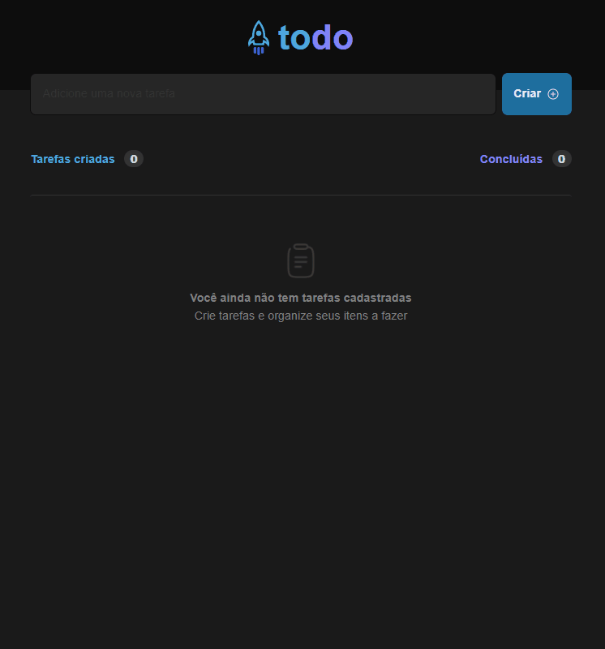

# desafio-01-reactjs-tsx
<p align="center">Este projeto é uma aplicação de gerenciamento de tarefas do usuário.</p>

<p align="center">
  <a href="#features">Features</a> •
  <a href="#requisitos">Pré Requisitos</a> •
  <a href="#aplicacao">Aplicação</a> •
  <a href="#tecnologias">Tecnologias</a> •
  <a href="#autor">Autor</a> •
</p>

<h4>🚧 Projeto README 🚀Em constução....🚧 </h4>

## Features
- [x] Adicionar uma nova tarefa
- [x] Marcar e desmarcar uma tarefa como concluída
- [x] Remover uma tarefa da listagem
- [x] Mostrar o progresso de conclusão das tarefas


## Requisitos
Antes de começar você vai precisar ter instalado em sua máquina as seguites ferramentas: <a href="https://git-scm.com/">git</a> e <a href="https://nodejs.org/en/">NodeJS</a>.

Além disso é bom ter um editor para trabalhar com o código como <a href="https://code.visualstudio.com/">VsCode</a>.
## Aplicacao
<h1 align="center">
  
</h1>

```bash
# Clone este repositório
$ git clone <https://github.com/mguib/desafio-01-reactjs-tsx.git>

# Acesse a pasta do projeto no terminal/cmd
$ cd desafio-01-reactjs-tsx

# Instale as dependências
$ yarn
# OU
$ npm i

# Execute a aplicação em modo de desenvolvimento
$ npm run dev
```

## Tecnologias
As seguintes ferramentas foram usadas na constução do projeto:
- [TypeScript]
- [React]
- [Tailwindcss]
- [TypeScript]
- [Node.js]

## Autor
Made with 💜 by Marcos Guibson ✌ [See my LinkedIn](https://www.linkedin.com/in/marcos-guibson-santos-da-silva-0b62321a3/)


